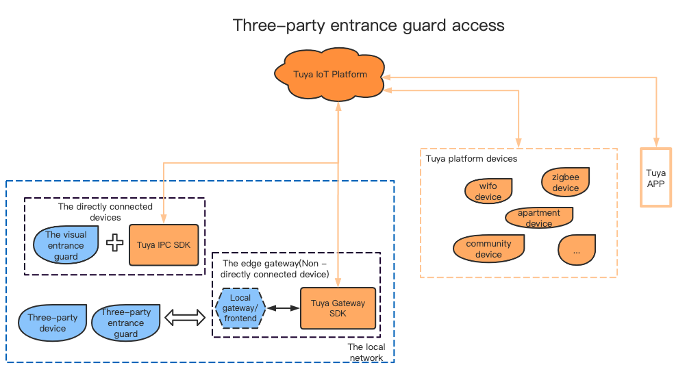

[English](README.md) | [中文版](README_zh.md)

`tuyasmart_android_saas_edge_ipc_demo`
Tripartite access control equipment built-in Tuya IPC SDK refer to this  demo。Device manufacturers can refer to this demo and access Tuya through saas-SDK。


# The overall architecture

​           

​      This document supports only the directly connected device, that is, the Tuya IPC SDK built into the three-party access device.


#  Docking process

   ## Depend on the configuration
```
  implementation 'com.squareup.okhttp3:okhttp:3.14.0'
  implementation 'org.apache.commons:commons-lang3:3.3.2'
```

   ## Download jizhi Community app

​            The app store downloads the App of Jizhi Community, and establishes audio and video calls with the device through the APP.

 ## Three-party Device Import Tuya EDGE IPC SDK

​            Tuya EDGE IPC SDK and demo address:

​                      https://github.com/TuyaInc/tuyasmart_android_saas_edge_ipc_demo

​            EDGE IPC SDK based on the Tuya IPC SDK developTuya IPC SDK  document address:

​                       https://tuyainc.github.io/tuyasmart_android_device_sdk_doc

