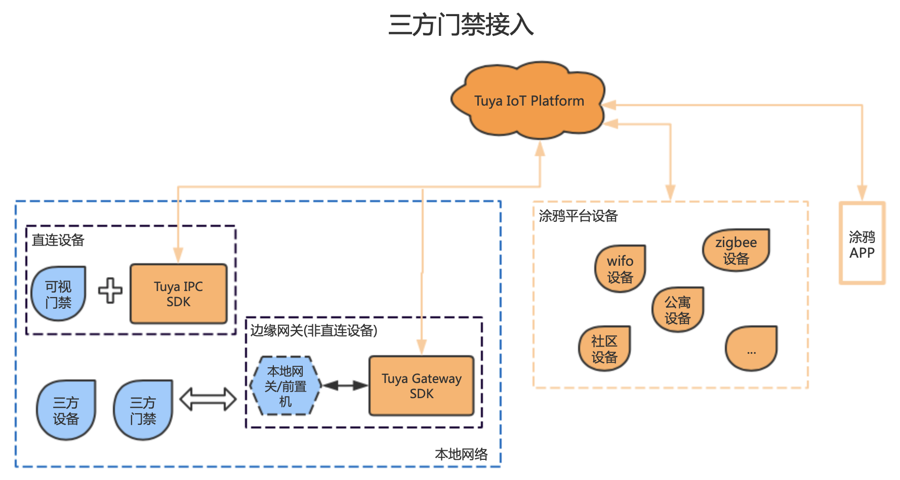
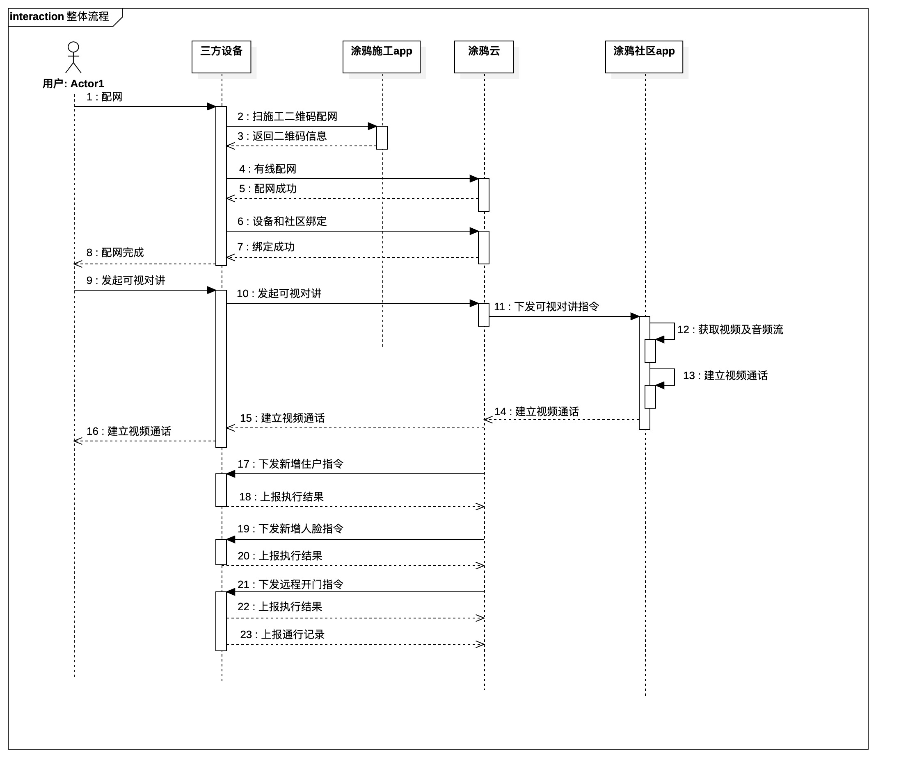

[English](README.md) | [中文版](README_zh.md)

`tuyasmart_android_saas_edge_ipc_demo`
三方门禁设备内置Tuya IPC SDK接入demo。设备厂商可参考此demo，通过saas-sdk接入到涂鸦。


# 整体架构

​           

​      本文档仅支持直连设备的接入方式, 即三方门禁设备内置Tuya IPC SDK的方式.


# 业务流程



# 功能点列表

| 序号 | 功能点      | 说明                   |
| ---- | ------------ | --------------------------- |
| 1    | 设备配网 | 三方设备配网完成后,才能接收涂鸦云的指令,和涂鸦云进行交互 |
| 2    | 视频通话 | 包含发起呼叫、接听、挂断 |
| 3    | 住户操作 | 包括住户的新增、更新、移除、禁用、启用 |
| 4 | 人脸操作 | 包括人脸的新增、更新、移除 |
| 5 | 门禁卡操作 | 包括门禁卡的新增、更新、移除 |
| 6 | 二维码操作 | 包括二维码的新增、更新、移除 |
| 7 | 远程开门 | 用户通过涂鸦app, 下发开门指令给门禁设备, 门禁设备收到开门指令后, 打开门并上报通行记录 |
| 8 | 通行事件上报 | 门禁设备识别到有人通行, 上报通行记录 |
| 9 | 评估人脸照片分数 | 服务端评估抓拍的人脸照片分数, 仅在酒店前台登记客户时使用 |
| 10 | 动态刷新住户通行二维码 | 除支持下发的二维码通行以外, 增加了对动态可刷新二维码通行的支持 |
| 11 | 门禁通行密码操作 | 包括通行密码的新增、更新、移除 |


#  对接流程

   ## 依赖配置
```
  implementation 'com.squareup.okhttp3:okhttp:3.14.0'
  implementation 'org.apache.commons:commons-lang3:3.3.2'
```

   ## 下载集智社区app

​            应用商店下载集智社区app, 通过集智社区app建立起和设备之间的音视频通话.

 ## 三方设备引入涂鸦EDGE IPC SDK

​            涂鸦EDGE IPC SDK及demo地址:

​                      https://github.com/TuyaInc/tuyasmart_android_saas_edge_ipc_demo

​            EDGE IPC SDK基于涂鸦IPC SDK开发,涂鸦IPC SDK文档地址:

​                       https://tuyainc.github.io/tuyasmart_android_device_sdk_doc


##  进行设备配网,初始化配置

### 申请私钥

​                向涂鸦申请私钥,申请的私钥用来对配网信息进行解密.

### 设备扫码

​        二维码的生成地址: https://community.console.tuya.com/gateway/device, 测试账号向涂鸦申请

​         设备扫描施工app二维码, 进行设备配网. 二维码信息格式:

```
{
    "t":"AYRfQAw5nmpr_0",
    "a":"a1-cn.wgine.com",
    "key":"1168813909092601857"
}
```

​        二维码生成后,10分钟就会过期.

​        设备根据a、key和cid调用接口, 获取二维码的内容并解密, 解密结果转为qrcodeMap.

```
//查询配网信息
NetQrcodeVO netQrcodeVO = AtopFacade.getInstance().queryQrcodeInfo(a, key, cid);
//对配网信息进行解密
String qrcodeInfo = AESUtils.decrypt(netQrcodeVO.getData(), secret);

//组装qrcodeMap;
Map<String, String> qrcodeMap = JSON.parseObject(qrcodeInfo, new TypeReference<HashMap<String, String>>() {});
qrcodeMap.put(QrcodeEnum.TOKEN.getCode(), t);
```


###  初始化SDK

```
    /**
     * 扫二维码配网及设备重启时调用
     *
     * @param ctx                     系统上下文
     * @param cid                     三方设备id,不同的设备唯一
     * @param qrcodeMap               二维码信息Map,见1.3.2
     * @param basePath                可写的一个路径,用于存储SDK相关的配置,建议app存储目录.
     * @param recordPath              可写的一个路径,用于存储录像,建议sd卡.
     * @param properties              实现类的配置
     * @param paramConfigCallBack     音视频参数设置回调
     */
    public void initSDK(Context ctx, String cid, Map<String,String> qrcodeMap,
          String basePath, String recordPath, Properties properties,
          MediaParamConfigCallback paramConfigCallBack)

```
​       qrcodeMap的key参见QrcodeEnum的code,  其中 t、 pId、 uuid、authKey在配网成功后, 需要写入系统.保证设备重启、断电或恢复出厂设置后,还能重新获取,从而连上涂鸦云.

​      判断设备是否配网成功:

```
 SharedPreferences sp = ctx.getSharedPreferences("edge_config",Context.MODE_PRIVATE);
 boolean isBind = sp.getBoolean("bind_status",false);
```

​      如果isBind = true,即为配网成功.

### 初始化门禁接口实现类

​         properties的key参见下面的示例, value是由三方对目录6中接口的实现, 初始化后的实现类才会被调用.

```
Properties properties = new Properties();
//住户数据同步类
properties.put("dc_userInfo","com.tuya.ai.ipcsdkdemo.edge.TenementReceiveEventImpl");
//人脸数据同步
properties.put("dc_faceInfo","com.tuya.ai.ipcsdkdemo.edge.FaceImageReceiveEventImpl");
//卡数据同步
properties.put("dn_cardInfo","com.tuya.ai.ipcsdkdemo.edge.CardReceiveEventImpl");
//二维码数据同步
properties.put("dc_qrCodeInfo","com.tuya.ai.ipcsdkdemo.edge.QcCodeReceiveEventImpl");
//开门
properties.put("dc_door","com.tuya.ai.ipcsdkdemo.edge.DoorReceiveEventImpl");
```

##  实现接口

​            IPC SDK已经将涂鸦云下发的指令封装成了接口, 三方只需要实现具体的接口, 接口列表参见目录6.

